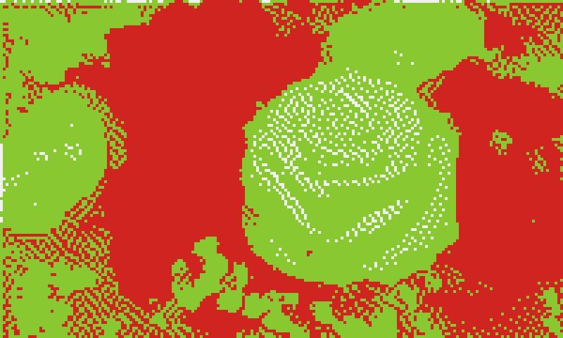
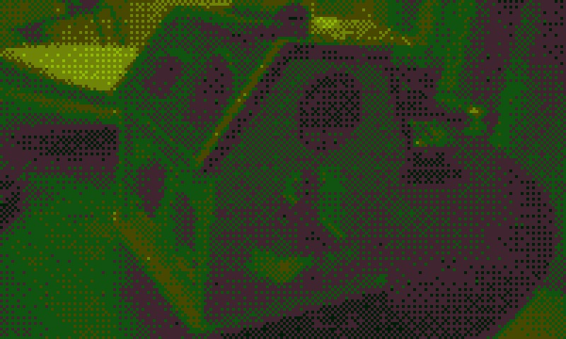
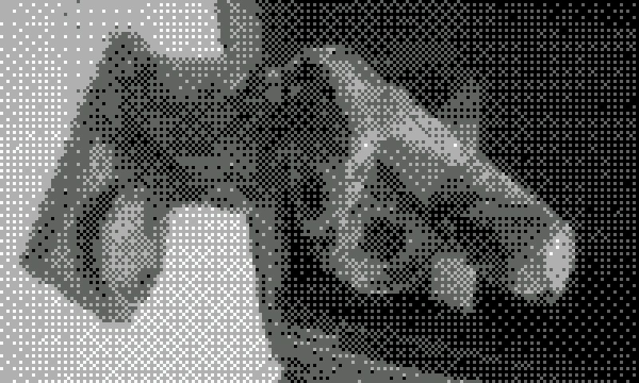
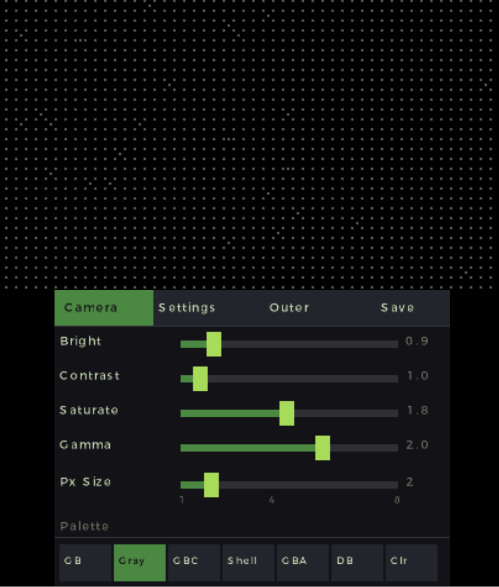
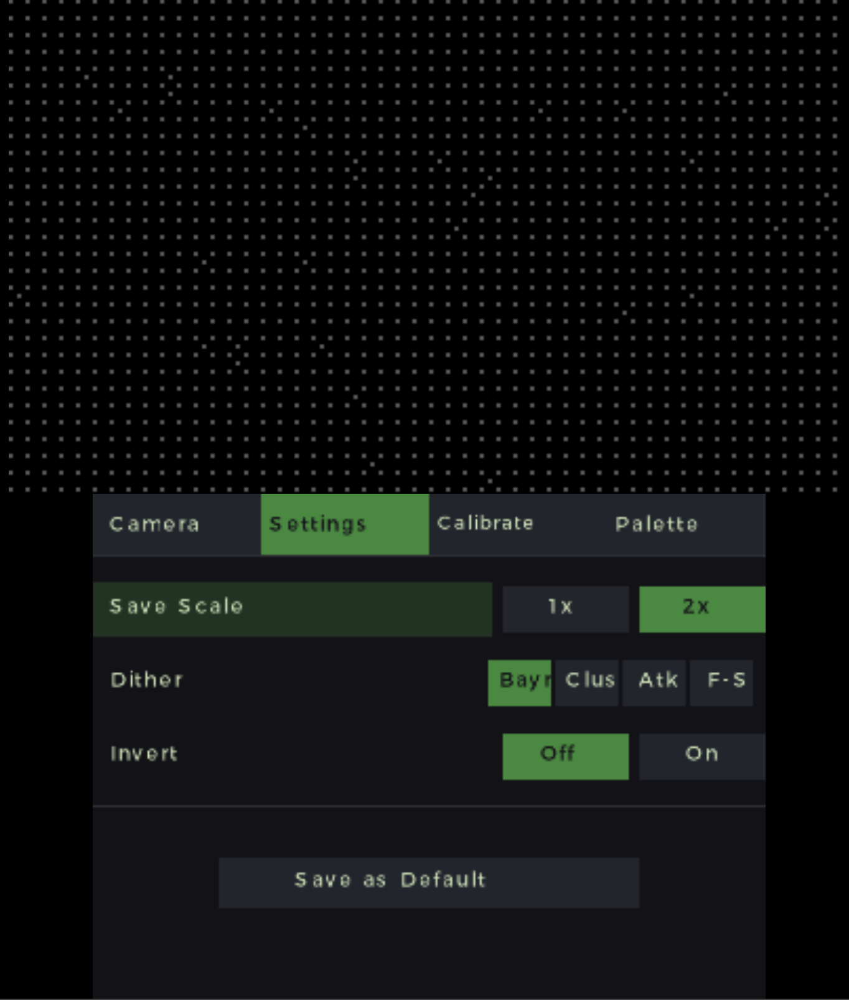
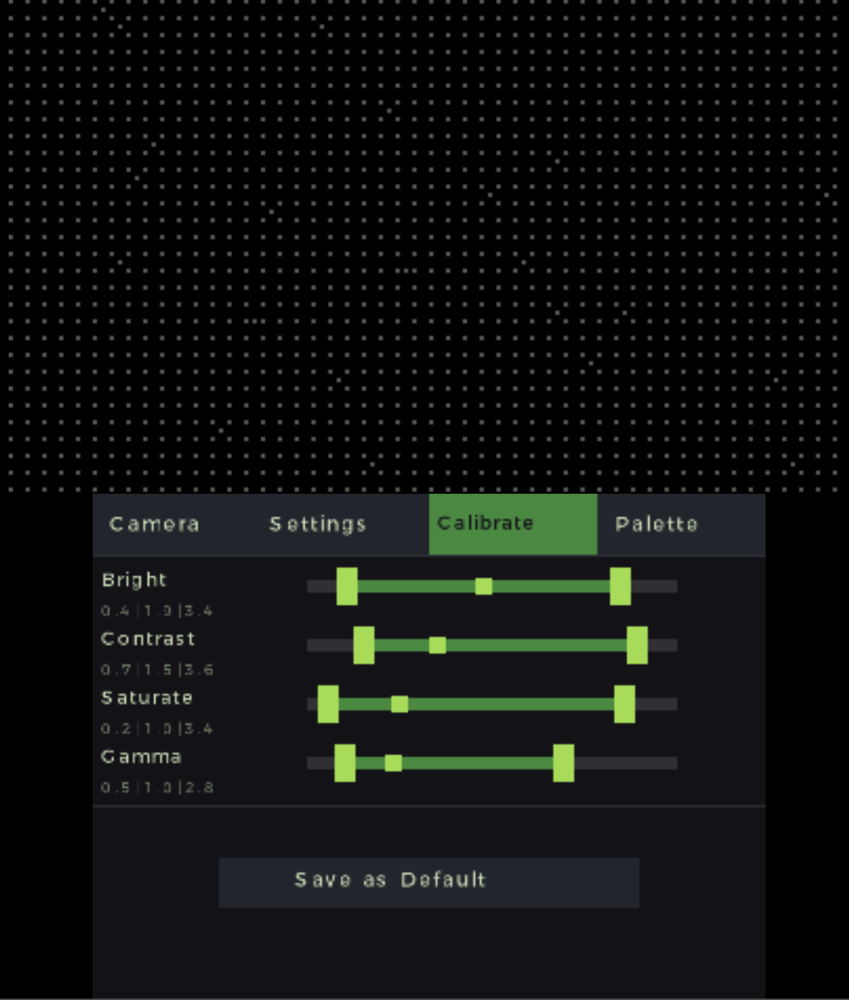
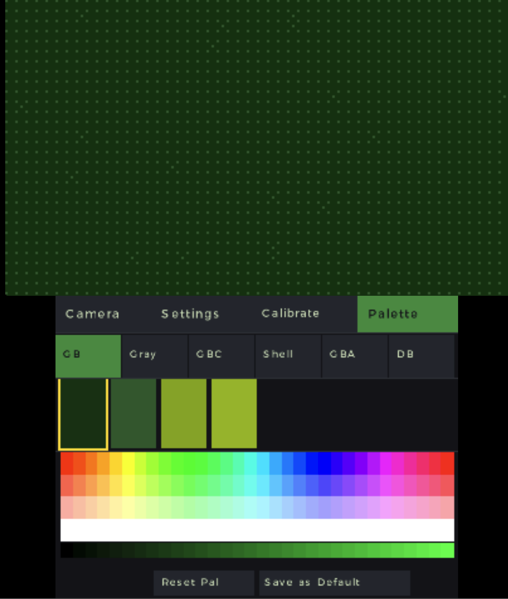
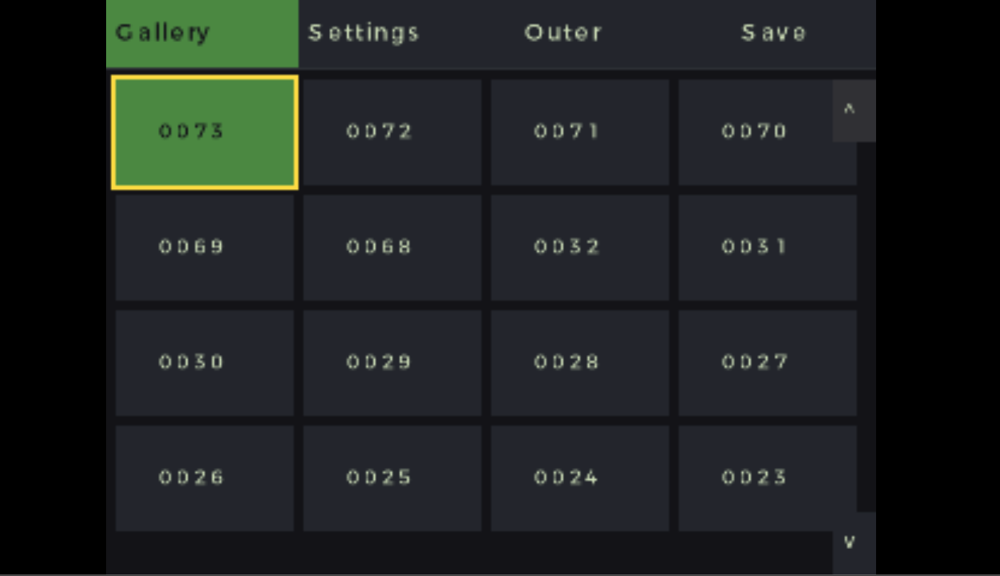

# PixelPix 3D

A Game Boy-style camera app for the Nintendo 3DS. Point it at something, pick a palette, and save retro-filtered photos to your SD card.

| Shell palette | DB palette | GB Grays palette |
|:---:|:---:|:---:|
|  |  |  |

---

## What you need

- A Nintendo 3DS (any model) with homebrew access
- An SD card

No computer required once it's installed.

---

## Installing

### Option A — Homebrew Launcher (easiest)

1. Download `3ds_camera.3dsx` from the [releases page](https://github.com/z-alzayer/3ds_camera/releases)
2. Copy it to the `/3ds/` folder on your SD card
3. Launch it from the Homebrew Launcher

### Option B — Install as a full app (CIA)

1. Download `3ds_camera.cia` from the [releases page](https://github.com/z-alzayer/3ds_camera/releases)
2. Copy it anywhere on your SD card
3. Open [FBI](https://github.com/Steveice10/FBI), navigate to the file, and install it
4. The app will appear on your home menu like any normal game


---

## Taking a photo

The live filtered view is always on the top screen. When you see something you like, just save it.

- **A** (or tap the **Save** button) — saves the current frame to your SD card
- **Y** (or tap the **Outer/Selfie** button) — switches between the rear and front camera

Photos are saved to `sdmc:/DCIM/GameboyCamera/` as `GB_0001.JPG`, `GB_0002.JPG`, etc.

> Hold **SELECT** at any time to temporarily see the raw, unfiltered camera feed.

---

## The interface

The bottom screen has two tabs: **Camera** and **Settings**. Tap either label to switch.

### Camera tab



Four sliders let you adjust the look in real time:

| Slider | What it does |
|--------|-------------|
| Brightness | Lighter or darker overall |
| Contrast | Pushes darks and lights further apart |
| Saturation | Left = greyscale, right = vivid colour |
| Gamma | Lifts or deepens the midtones |
| Pixel Size | Adds a pixelation effect (snaps to 8 steps) |

Below the sliders are **6 palette buttons** — tap one to apply that colour palette. **L** / **R** cycle through them with buttons.

### Settings tab



| Setting | What it does |
|---------|-------------|
| Save Scale | **1×** saves at 400×240, **2×** saves at 800×480 (default) |
| Dither Mode | How colours blend at palette edges: **Bayer**, **Cluster**, **Atkinson**, or **Floyd-Steinberg** |
| Invert | Flips all colours to their negative |

From within the Settings tab, two extra tabs appear in the tab bar:

- **Calibrate** — adjust the min, max, and default value for each filter slider

  

- **Palette** — edit each palette's colours with RGB sliders; the top screen shows a live preview

  

When you've set things up the way you like, tap **Save as Default** to write your settings to the SD card. They'll be there the next time you open the app.

### Gallery



Tap **Gallery** in the tab bar to browse photos you've already saved. Use the D-Pad to move between photos. The selected photo shows full-screen on the top screen.

---

## Controls

| Input | Action |
|-------|--------|
| **A** | Save photo |
| **Y** | Toggle rear / front camera |
| **L / R** | Previous / next palette |
| **B** | Cycle pixel size |
| **D-Pad Up / Down** | Brightness (in Camera tab) |
| **D-Pad Left / Right** | Saturation (in Camera tab) |
| **SELECT** (hold) | Compare — show raw unfiltered feed |
| **START** | Quit |

---

## Palettes

| # | Name | Style |
|---|------|-------|
| 1 | GB Greens | Classic 4-colour Game Boy green |
| 2 | GB Grays | Monochrome greyscale |
| 3 | GBC Greenish | Game Boy Color green tones |
| 4 | GBC Shell | Colourful, inspired by GBC shell colours |
| 5 | GBA-like UI | Game Boy Advance UI colours |
| 6 | DB Retro | Darkbox retro palette |

You can customise any palette from the **Palette** editor in the Settings tab.

---

## Resetting to defaults

All your settings are stored in one plain-text file on the SD card:

```
sdmc:/3ds/pixelpix3d/settings.ini
```

To reset everything back to factory defaults, delete that file. The app will recreate it with defaults the next time you tap **Save as Default**.

You can also open `settings.ini` on a computer and edit values manually — it's just `key=value` pairs.

---

## Notes

**3D depth slider** — raising it shows a red warning screen. This may be fixed in an update but currently outside the scope of the project, I'm happy to accept a PR if someone wants to put the time in.

---

## Building from source

### Requirements

- [devkitARM](https://devkitpro.org/) with 3DS support
- libctru, citro2d, citro3d (via devkitPro)
- `makerom` binary in the project root (for CIA builds)

```bash
make          # builds 3ds_camera.3dsx
make cia      # builds 3ds_camera.cia
make clean    # cleans build output
```
