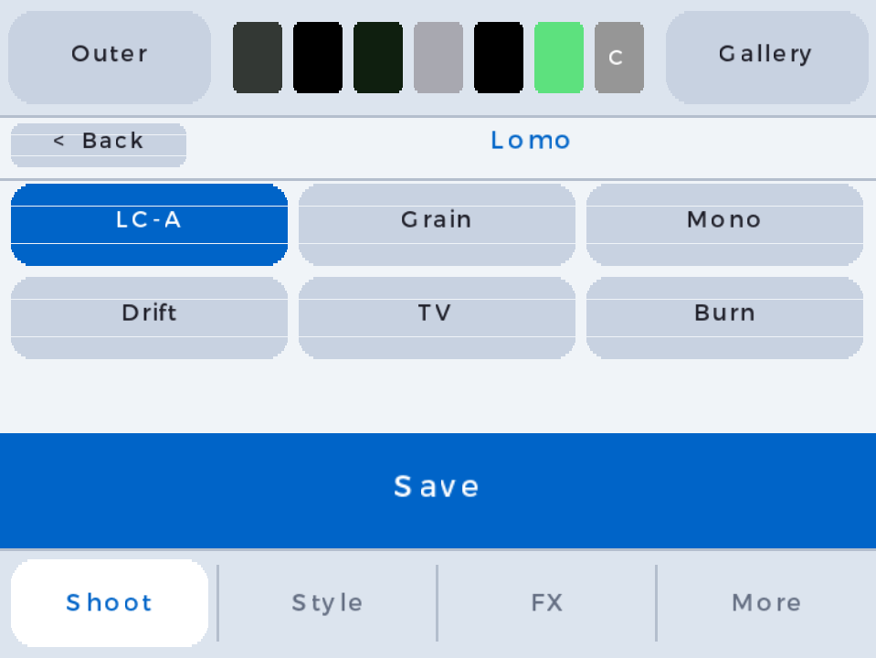
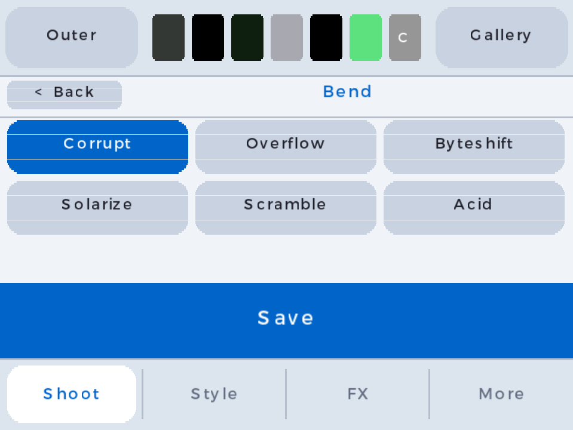
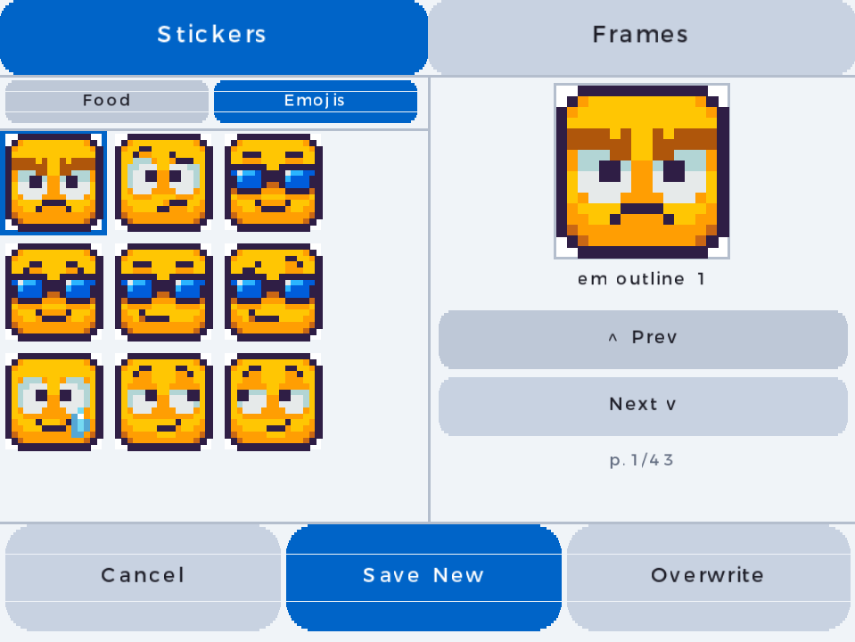
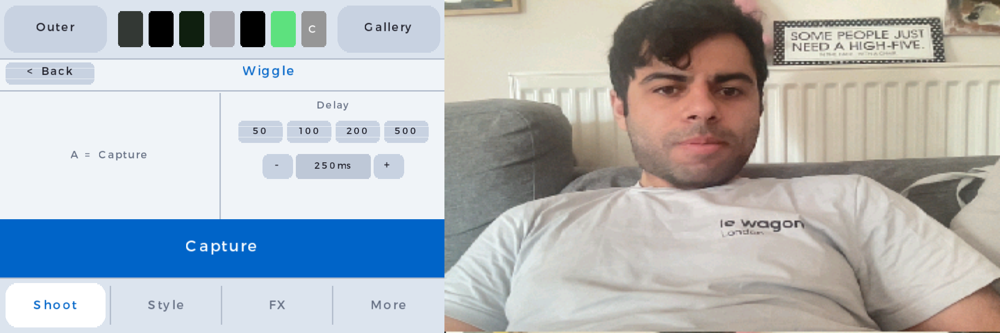
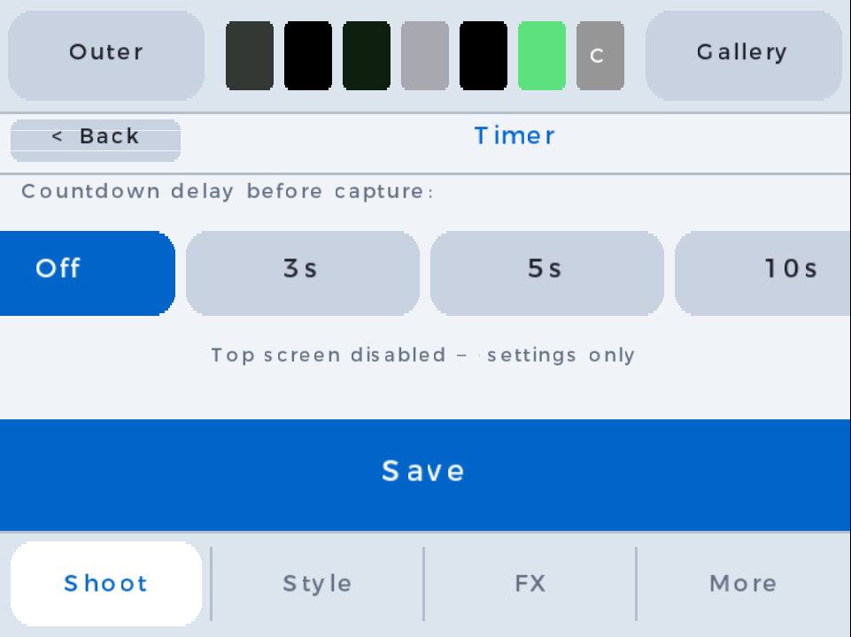
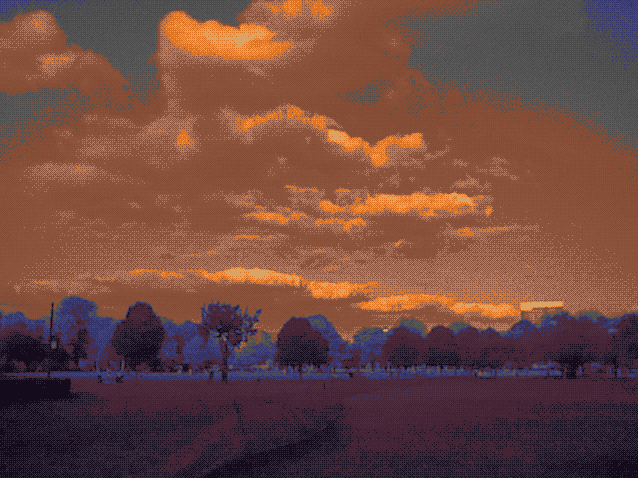
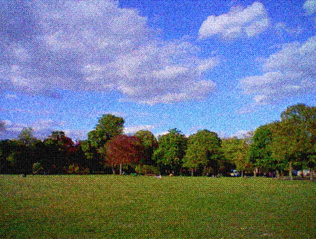
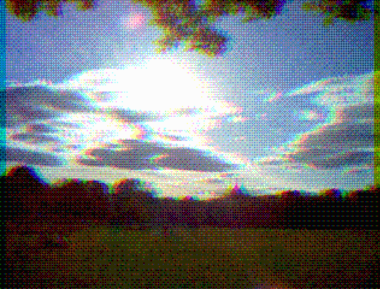

# PixelPix 3D

A Game Boy inspired camera app for the Nintendo 3DS. Point it at stuff and take pictures.

| Main screen | Dither settings | Custom palettes |
|:---:|:---:|:---:|
|  |  |  |

| Lomo filters | Bending filters | Frames & stickers |
|:---:|:---:|:---:|
|  |  |  |

| Gallery | Wiggles | Timer |
|:---:|:---:|:---:|
|  |  |  |

**Wiggle GIFs**

| | | |
|:---:|:---:|:---:|
|  |  |  |

---

## Disclaimer

This software is provided as-is. I am not responsible for any lost, corrupted, or overwritten files. **Always back up your images and or SD card before installing or updating.** Whilst I do try to avoid any data loss, this is a one person operation and I can't absolutely guarantee against data loss. 

---

## What you need

- A Nintendo 3DS (any model) with homebrew access
- An SD card

---

## Installing

### Option A — Homebrew Launcher (easiest)

1. Download `3ds_camera.3dsx` from the [releases page](https://github.com/z-alzayer/PixelPix3D/releases)
2. Copy it to the `/3ds/` folder on your SD card
3. Launch it from the Homebrew Launcher

### Option B — Install as a full app (CIA)

1. Download `3ds_camera.cia` from the [releases page](https://github.com/z-alzayer/PixelPix3D/releases)
2. Copy it anywhere on your SD card
3. Open [FBI](https://github.com/Steveice10/FBI), navigate to the file, and install it
4. The app will appear on your home menu

---

## The interface

The bottom screen has tabs: **Camera**, **Settings**, **Gallery**, and more. Tap a label to switch.

### Camera tab

Four sliders let you adjust the look in real time: **Brightness**, **Contrast**, **Saturation**, **Gamma**, and **Pixel Size**. Below the sliders are **6 palette buttons** — tap one or use **L / R** to cycle.

### Filters

- **Lomo** — colour-shift and vignette effects
- **Bending** — warps and distorts the image geometry
- **Frames & Stickers** — overlay pixel-art frames and stickers on your photos

### Wiggles

Take a burst of frames and save them as an animated GIF. Great for lo-fi motion shots.

### Timer

Set a countdown before the shutter fires — useful for selfies or group shots.

### Settings tab

| Setting | What it does |
|---------|-------------|
| Save Scale | **1×** saves at 400×240, **2×** saves at 800×480 (default) |
| Dither Mode | **Bayer**, **Cluster**, **Atkinson**, or **Floyd-Steinberg** |
| Invert | Flips all colours to their negative |

From within Settings, two extra tabs appear:

- **Calibrate** — adjust the min, max, and default value for each slider
- **Palette** — edit each palette's colours with RGB sliders; top screen shows a live preview

Tap **Save as Default** to persist your settings to the SD card.

### Gallery

Browse saved photos with the D-Pad. The selected photo shows full-screen on the top screen.

---

## Controls

| Input | Action |
|-------|--------|
| **A** | Save photo |
| **Y** | Toggle rear / front camera |
| **L / R** | Previous / next palette |
| **B** | Cycle pixel size |
| **D-Pad Up / Down** | Brightness |
| **D-Pad Left / Right** | Saturation |
| **SELECT** (hold) | Compare — show raw unfiltered feed |
| **START** | Quit |

---

## Palettes

| # | Name | Style |
|---|------|-------|
| 1 | GB Greens | Classic 4-colour Game Boy green |
| 2 | GB Grays | Monochrome greyscale |
| 3 | GBC Greenish | Game Boy Color green tones |
| 4 | GBC Shell | Colourful, inspired by GBC shell colours |
| 5 | GBA-like UI | Game Boy Advance UI colours |
| 6 | DB Retro | Darkbox retro palette |

All palettes are editable from the **Palette** tab in Settings.

---

## Resetting to defaults

Delete `sdmc:/3ds/pixelpix3d/settings.ini` to reset everything. The app recreates it with defaults the next time you tap **Save as Default**. You can also edit the file manually — it's plain `key=value` pairs.

---

## Notes

**3D depth slider** — raising it shows a red warning screen. Outside the current scope; happy to accept a PR.

---

## Credits

### Pixel art food stickers
**Free Pixel Art Foods** by [alexkovacsart](https://alexkovacsart.itch.io/free-pixel-art-foods) — Licensed under [CC BY 4.0](https://creativecommons.org/licenses/by/4.0/).

### Emoji stickers
**Emoji Comic Pack** by [Notokapixel / narehop](https://narehop.itch.io/emoji-comic-pack) — Licensed under [CC0 1.0 Universal](https://creativecommons.org/publicdomain/zero/1.0/).

---

## Building from source

Requires [devkitARM](https://devkitpro.org/) with 3DS support, libctru, citro2d, citro3d, and `makerom` in the project root.

```bash
make          # builds 3ds_camera.3dsx
make cia      # builds 3ds_camera.cia
make clean    # cleans build output
```
